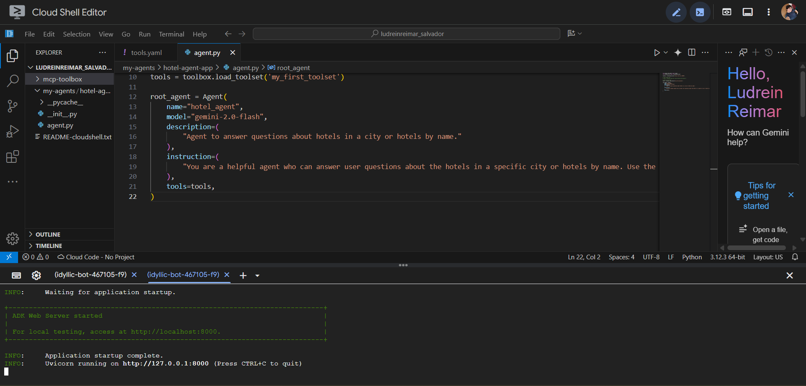
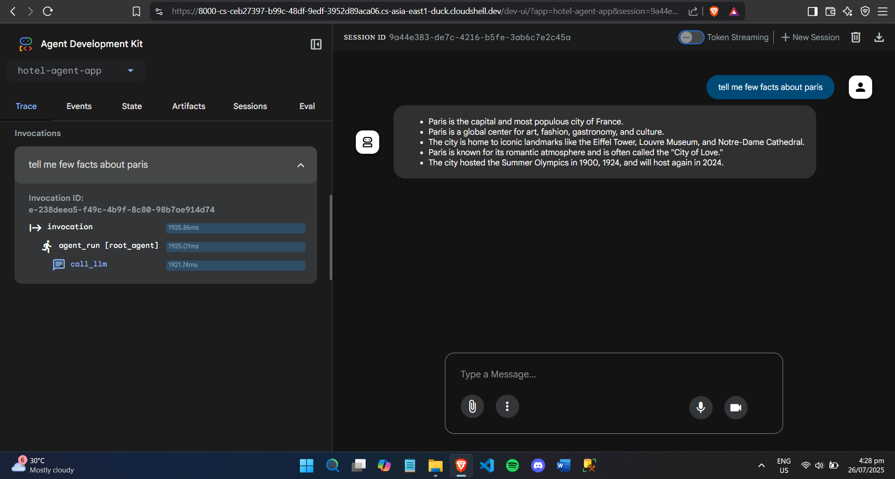

# Google I/O Extended Manila 2025 - Codelabs

My learnings, explorations, and hands-on coding workshops from Google I/O Extended Manila 2025, held on July 26, 2025 at Accenture People HUB, BGC.

## Event Overview

Google I/O Extended Manila 2025 was a full-day developer event featuring inspiring talks, hands-on codelabs, and the latest Google technologies. The event brought together passionate developers to explore AI, machine learning, and cutting-edge web technologies.

## Codelabs I Participated In

### 1. Multimodal Live API with Gen AI SDK

**Speaker:** Ralph Vincent Regalado (GDE for Machine Learning, Chief Scientist at Kollab/Senti AI Philippines)

Explored the capabilities of Google's Multimodal Live API using the Gen AI SDK. This codelab demonstrated real-time integration of text, audio, and visual inputs to create intelligent AI experiences.

I learned how to implement multimodal AI that can see, hear, and understand simultaneously. I also discovered real-time API integration with Gen AI SDK, and processing different data types (text, audio, images) in a unified system.

**Folder:** [`multimodal-live-api-genai-sdk-codelab-1/`](./multimodal-live-api-genai-sdk-codelab-1/)

**Files:**
- [`[codelab_1]_intro_multimodal_live_api_genai_sdk.ipynb`](./multimodal-live-api-genai-sdk-codelab-1/[codelab_1]_intro_multimodal_live_api_genai_sdk.ipynb) - Main Jupyter notebook with implementations (includes Google LLC Apache License 2.0)
- [`sample-audio-file/hello_are_you_there.pcm`](./multimodal-live-api-genai-sdk-codelab-1/sample-audio-file/hello_are_you_there.pcm) - Sample audio file for testing

### 2. Build a Travel Agent using MCP Toolbox & Agent Development Kit (ADK)

**Speaker:** Punsiri Boonyakiat (GDE for AI, Lead Data Engineer at Central Food Retail Group Thailand)

Built an intelligent travel agent using Google's MCP (Model Context Protocol) Toolbox and Agent Development Kit. This codelab focused on creating agentic AI that can reason, plan, and respond to user queries for dynamic travel recommendations.

I learned how implementing agentic AI systems for practical applications work using MCP Toolbox for database interactions. I also discovered the Agent Development Kit (ADK) for building intelligent conversational agents. I got the chance to create a Hotel Agent app that uses AI and can understand context and provide personalized recommendations.

**Folder:** [`travel-agent-mcp-toolbox-adk-codelab-2/ludreinreimar_salvador/`](./travel-agent-mcp-toolbox-adk-codelab-2/ludreinreimar_salvador/)

**Files:**
- [`mcp-toolbox/`](./travel-agent-mcp-toolbox-adk-codelab-2/ludreinreimar_salvador/mcp-toolbox/) - MCP Toolbox implementation files
- [`my-agents/`](./travel-agent-mcp-toolbox-adk-codelab-2/ludreinreimar_salvador/my-agents/) - Custom agent configurations and logic
- [`README-cloudshell.txt`](./travel-agent-mcp-toolbox-adk-codelab-2/ludreinreimar_salvador/README-cloudshell.txt) - Cloud Shell setup instructions
- [`my-adk-localhost.txt`](./travel-agent-mcp-toolbox-adk-codelab-2/ludreinreimar_salvador/my-adk-localhost.txt) - Local development configuration

**Screenshots of the Travel Agent App:**

## Takeaways

I learned that Multimodal AI is transforming how we interact with technology by combining multiple input types. Agentic AI systems can also provide more intelligent and context-aware responses. Furthermore, real-time APIs enable seamless integration of AI capabilities into applications and Agent Development Kit simplifies the creation of sophisticated AI agents.

## Technologies Used

- Google Gen AI SDK
- Multimodal Live API
- MCP (Model Context Protocol) Toolbox
- Agent Development Kit (ADK)
- Jupyter Notebooks
- Python

## Acknowledgments

Extending my appreciation to Google Developer Groups Manila for organizing this amazing event and to all the speakers who shared their expertise and passion for technology.

## License & Attribution

The codelab implementations in this repository are based on Google's official tutorial materials and code examples, which are licensed under the Apache License 2.0. The original materials are © 2024 Google LLC.

**Original Source**: Google Colab notebooks from Google I/O Extended Manila 2025 codelabs  
**Modifications**: Adapted for personal learning and documentation purposes

For the complete license terms, see the Apache License 2.0 at: https://www.apache.org/licenses/LICENSE-2.0

---

*This repository contains my learning journey from Google I/O Extended Manila 2025. Each codelab represents hands-on exploration of AI and machine learning technologies.*
